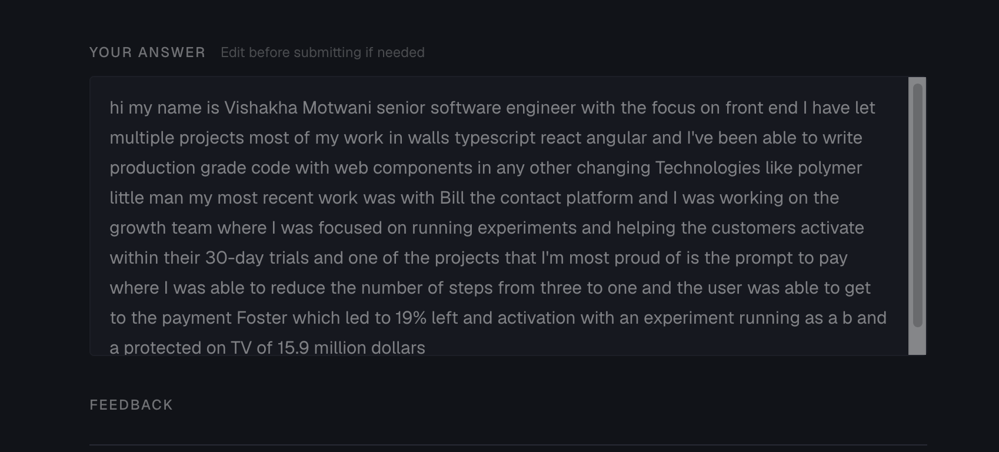
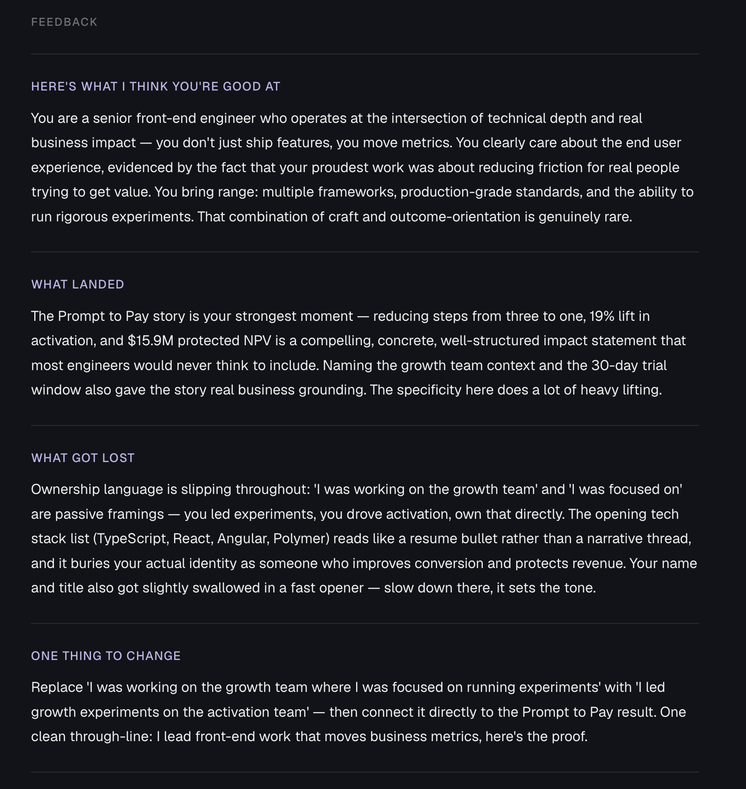

# The Unfiltered Take

Practice your story, own your impact. A voice recording tool for anyone in tech to practice their "tell me about yourself" interview answer and get AI feedback from a recruiter's perspective.

> **Requires Chrome** — uses the Web Speech API for in-browser transcription.


*The recording interface*

---

## Why I built this

Through conversations and interviews with people in tech, I kept hearing the same thing: people with real, strong impact consistently underselling it. Not because the work wasn't there — because the language minimized it.

The more answers I heard, the clearer the actual gap became. What people need to know isn't how a coach hears them, or how they hear themselves, or even what a generic AI tool says back. It's how a recruiter — someone with zero context, hearing this once, forming a real impression — actually takes it in.

This tool listens like that. No backstory, no relationship, just the answer as a recruiter would hear it.

---

## How it works

1. Hit the mic button and answer out loud — you have up to 3 minutes
2. Stop recording. A transcript appears, editable if the speech recognition missed anything
3. Submit. Claude analyzes the answer and returns structured feedback in four sections. Download the result as an image — transcript and feedback together — to keep as your own version history and track progress over time.
   - **Here's what I think you're good at** — a mirror of who you come across as, not a generic compliment
   - **What landed** — specific moments or phrasing that worked
   - **What got lost** — what was unclear, buried, or missing entirely
   - **One thing to change** — one concrete, immediately actionable fix


*Example feedback on a strong, complete answer*

---

## What makes the feedback different

The feedback is framed from a recruiter's perspective, not a coach's. It reflects what someone on the other side of the interview table would actually take away — not encouragement for encouragement's sake.

Two patterns it's specifically tuned to catch:

**Ownership language.** People in technical roles consistently undersell individual contribution. The prompt explicitly flags "we" instead of "I", "worked on" instead of "led", "helped with" instead of "owned" — and suggests stronger alternatives directly.

**Tone calibration.** A thin or incomplete answer gets told so. The feedback doesn't open with praise an answer hasn't earned. A short, vague answer gets a direct response naming the gaps. Strong, complete answers get genuine enthusiasm. The feedback matches the actual quality of what was said.

---

## Architecture decisions

- **CSS modules over Tailwind** — wanted clean separation between structure and style without a utility class sprawl in JSX
- **Web Speech API over Whisper or Deepgram** — free, no extra API key, no audio leaving the browser, good enough for MVP; the goal is practice, not perfect transcription
- **Vercel serverless functions over a separate backend** — single repo, single deploy, Claude calls stay server-side so the API key is never exposed
- **No auth** — removes friction; there's nothing to protect because no audio is stored and no user data is kept
- **Supabase for a usage counter only** — one table, one row, one integer; not user data, just a submission count to track usage
- **System prompt in an environment variable, not in code** — the prompt is the product's real differentiator; it should be iterable without a deploy, and it shouldn't live in git history

---

## Stack

React · TypeScript · Vite · CSS Modules · Vercel · Supabase · Claude API (`claude-sonnet-4-6`) · Web Speech API

---

## Running locally

```bash
git clone https://github.com/vishakhamotwani/unfiltered.git
cd unfiltered
npm install

cp .env.example .env
# Fill in: ANTHROPIC_API_KEY, VITE_SUPABASE_URL, VITE_SUPABASE_ANON_KEY
# UPSTASH_REDIS_REST_URL and _TOKEN are optional — rate limiting is skipped if absent
# FEEDBACK_SYSTEM_PROMPT — set your system prompt here
```

Run the Supabase setup SQL once in your project's SQL editor:

```bash
# Open supabase-setup.sql and run it in the Supabase dashboard → SQL editor
```

Then start the dev server:

```bash
npm run dev        # Vite only — API calls won't work without Vercel
vercel dev         # Full local environment including serverless functions
```
